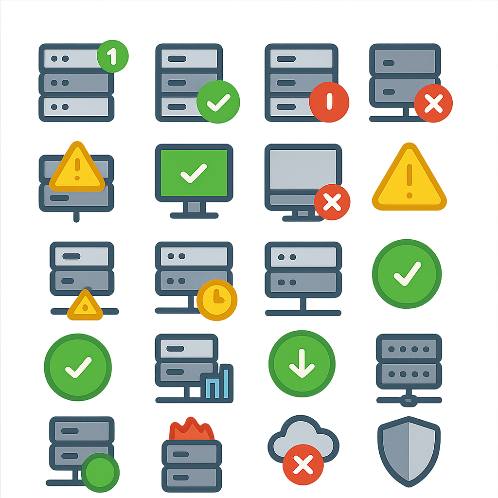

# このプロジェクトは

TeamsのWebhookで使用するためのアイコンを作りたかった

## 1.イメージ作成

ChatGPTにお願いするのが結局一番楽

```
5x5=25個でアイコンを作成して
背景は透明とする
テーマ：サーバーの状態
```


# アイコン画像処理スクリプト集

このディレクトリには、画像分割・キャプション生成などのPythonスクリプトが含まれています。

---

## split_icons.py

### 概要
- images_5x5フォルダ内の画像を、透明ライン（アルファ値128未満）で自動分割します。
- 分割した各アイコンを128x128ピクセルにリサイズし、透明でないエリアの重心が(64,64)になるように中央配置します。
- 完全に透明なアイコンは出力しません。
- 出力ファイルはoutputフォルダに「元画像名+連番.png」で保存されます。

### 実行方法
1. 必要なパッケージをインストール
   ```bash
   pip install -r requirements.txt
   ```
2. images_5x5フォルダに分割したい画像を配置
3. スクリプトを実行
   ```bash
   python split_icons.py
   ```
4. outputフォルダに分割・リサイズ済みアイコンが出力されます

---

## caption_image.py

### 概要
- 指定した画像ファイルから英語キャプション（短い説明文）を自動生成します。
- Hugging FaceのBLIPモデルを利用しています。

### 実行方法
1. 必要なパッケージをインストール
   ```bash
   pip install -r requirements.txt
   ```
2. 画像ファイルを同じディレクトリまたは指定パスに配置
3. スクリプトを実行
   ```bash
   python caption_image.py
   ```
4. 端的な英語キャプションがコンソールに表示されます
